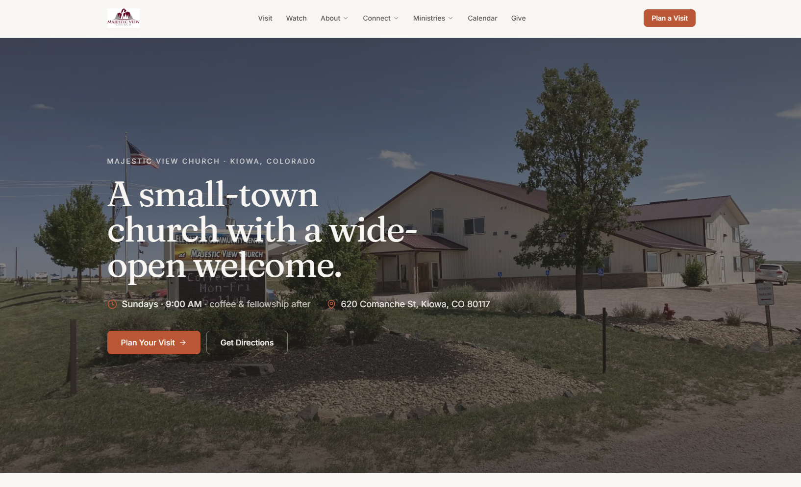
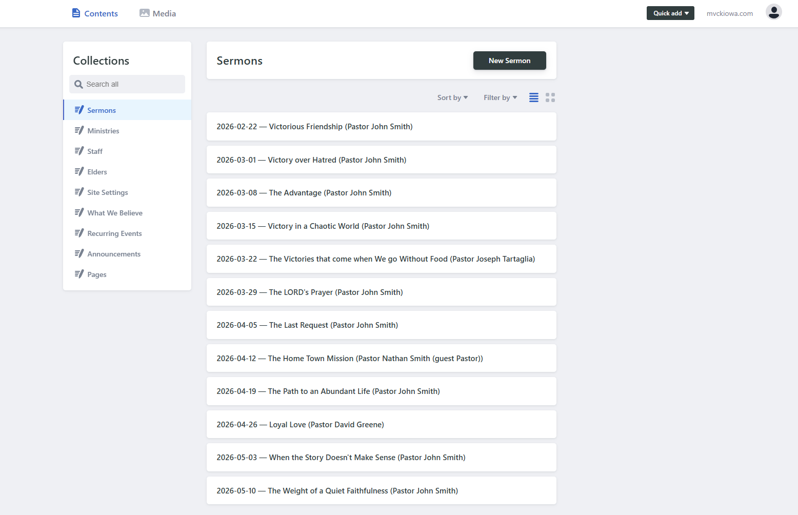

# Church Site Template

> A free, modern, mobile-first website template for small churches. Editors update content in their browser — no developer needed long-term. Deploy free on Vercel — about 30 minutes of hands-on time, plan for ~90 minutes the first time end-to-end if you're also installing Node.js, signing up for Vercel and TinaCloud, and waiting on DNS.

---

## 🚀 Start here — Use this template

**Click the green "Use this template" button at the top of this page** to create your own copy of this repo under your GitHub account. That gives your church its own independent codebase, ready to customize and deploy.

> 💡 *"Use this template"* is the modern, simpler alternative to forking. You get a clean repo with no fork history — better for a long-running church website. If you prefer the classic fork-and-clone flow (e.g. for staying in sync with template updates), see [the developer notes on syncing template changes](docs/for-developers/contributing.md#keeping-a-church-instance-in-sync-with-the-template).

Once you have your own copy, follow the [setup guide](docs/for-tech-volunteers/01-overview.md) — about 30 minutes of hands-on work, ~90 minutes of real elapsed time the first time you do it.

---

## Why this exists

Small churches often can't afford a professional website and can't maintain a custom build over the long term — meaning they end up either with no website at all, or with a fragile DIY one that no one knows how to update once the volunteer who built it moves on. This template closes that gap: a polished, modern site that any small church can adopt for free, that a non-technical staff member can keep up to date in their browser, and that doesn't rot when the original tech volunteer leaves.

---

## What you get

A complete, production-ready church website with:

- **Modern, mobile-first design** — looks great on phones (where most visitors will see it) and scales up gracefully to tablets and desktops.
- **A browser-based editor (TinaCMS)** — staff sign in with Google and update sermons, staff bios, events, service times, and more without ever touching code. Changes go live automatically within 2-3 minutes.
- **Sermon archive** — searchable by series, speaker, scripture, or book of the Bible. YouTube embeds, podcast feed, audio downloads.
- **Calendar** — recurring weekly events and one-off events with `.ics` export and RSVP.
- **Prayer requests** — private-by-default form for visitors to submit prayer requests to the pastoral team.
- **Ministries** — one page per ministry, with leader, meeting times, photos, and a "what to expect" list.
- **Small groups finder** — filter by day, life stage, and neighborhood.
- **Volunteer signups** — a "where can I serve?" page with a filterable list of roles.
- **Plan-a-visit form** — captures first-time visitor info so you can welcome them by name.
- **Giving page** — multiple methods (online, text-to-give, mail, in-person), tax-deductible FAQ.
- **Newsletter signup** — wired for Mailchimp, Buttondown, Brevo, or similar (UI only by default).
- **Beliefs page** — your doctrinal statements, anchored in Scripture.
- **About / Our Story** — the human side of the church.
- **SEO-ready** — generates per-page meta tags, OpenGraph cards, and structured data.
- **Free hosting** — runs on Vercel's free tier; thousands of visitors a day before you'd hit any limit.
- **No vendor lock-in** — content lives as plain Markdown and JSON in your GitHub repo. Move it anywhere if you ever want to.

---

## What you'll need

Honest about the floor: this is not zero-effort, but it's well within reach for a "I'm the church's de facto IT person" volunteer.

| What | Cost | Notes |
|---|---|---|
| A GitHub account | Free | [Sign up at github.com](https://github.com/signup) if you don't have one. |
| ~30 min hands-on, plan ~90 min total first time | Free | Hands-on time vs. real elapsed time (installs + DNS wait) differ — see the [tech-volunteer overview](docs/for-tech-volunteers/01-overview.md) for the breakdown. |
| A Vercel account | Free | Free tier is plenty for typical small-church traffic (thousands of visitors a day). |
| A custom domain | ~$12/year (optional) | Like `yourchurch.org`. Optional — you can launch on a `*.vercel.app` URL first and add the domain later. |

**You do NOT need:** a credit card (everything required is free), a database, a server, programming experience, or a long-term contract with anyone.

After launch, the routine is about 10 minutes per month: a tech volunteer applies dependency updates. Editors handle the rest from their browser — no approval step needed.

---

## Pick your path

<table>
<tr>
<td width="25%" valign="top">

### 📝 I just want to edit content

For church staff who keep the site updated — sermons, events, staff bios, service times.

**[→ Editor guide](docs/for-editors/01-getting-started.md)**

</td>
<td width="25%" valign="top">

### 🛠️ I'm setting this up for my church

For the one semi-technical person at the church doing initial setup and deployment.

**[→ Setup guide (~90 min first time)](docs/for-tech-volunteers/01-overview.md)**

</td>
<td width="25%" valign="top">

### 🤝 I'm inheriting a site someone else built

For the volunteer taking over after the original setup person moved on. Service inventory, access handoff, first 60 minutes.

**[→ Successor runbook](docs/for-tech-volunteers/successor-runbook.md)**

</td>
<td width="25%" valign="top">

### 💻 I'm a developer

For developers customizing the template, contributing back, or maintaining a church's instance.

**[→ Architecture & developer guide](docs/for-developers/architecture.md)**

</td>
</tr>
</table>

---

## What it looks like

**The site itself:**

**The editor (TinaCMS):**

---

## Live examples

Churches that have adopted this template:

> **Your church here?** After you deploy your site, send a pull request adding it to this list and your own [case study](docs/case-studies/). We'd love to feature you. See [the case-studies folder](docs/case-studies/) for submission instructions.

---

## Everyday commands

Once you've cloned your copy:

| Command | When to use it |
| --- | --- |
| `npm run setup` | First-time setup. Asks for church name, address, colors, etc. and writes them in. |
| `npm run start` | Run the site on your computer to preview changes. |
| `npm run cms` | Start the local CMS proxy so `/admin/` works without GitHub auth. Run in a second terminal. |
| `npm run deploy` | Step-by-step walkthrough to put your site on the internet. |
| `npm run doctor` | Something's broken? This tells you what. |

> Don't have Node.js installed? You can do everything in your browser with [GitHub Codespaces](docs/for-tech-volunteers/03-use-this-template.md) — no install required.

---

## More

- [Documentation map](docs/README.md) — every doc, one-line description
- [FAQ](FAQ.md) — questions church staff and tech volunteers ask
- [Glossary](GLOSSARY.md) — plain-English definitions of CMS, repository, deploy, etc.
- [Case studies](docs/case-studies/) — real churches using this template
- [Contributing](docs/for-developers/contributing.md)
- [Code of conduct](CODE_OF_CONDUCT.md)
- [Security policy](SECURITY.md)
- [License](#license)

---

## License

MIT. See [LICENSE](LICENSE). Use it freely, including for commercial projects — though if you're a small church, the whole point is that it should be free to you.

## Credits

If your church adopts this template, we'd love to hear about it. Open a PR adding yourself to [Live examples](#live-examples) above and to [docs/case-studies/](docs/case-studies/).
